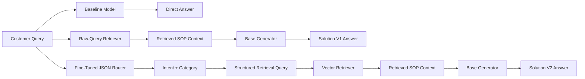

# Hybrid RAG and QLoRA Fine-Tuning for Customer Support

A comparative implementation of three customer-support architectures:

1. **Pretrained Baseline** — generates an answer directly from the customer query.
2. **Solution V1: Naive RAG** — retrieves an SOP using the raw query and generates a grounded response.
3. **Solution V2: Hybrid RAG** — uses a QLoRA-fine-tuned JSON intent router to construct a structured retrieval query before SOP retrieval and response generation.

The project focuses on **policy-grounded billing-dispute support** while evaluating the routing and generation pipeline across the complete held-out customer-support intent set.

---

## Project Objective

Customer-support queries are often incomplete, indirect, or emotionally worded. A general-purpose language model may produce a fluent response while inventing refund guarantees, reversal timelines, contact details, investigation procedures, or escalation routes.

This project investigates whether combining:

- structured intent and category prediction,
- semantic retrieval over corporate SOPs, and
- policy-grounded response generation

can improve retrieval precision and response quality while reducing unsupported claims.

---

## System Architecture



In this repository, **Hybrid RAG** refers to the combination of a fine-tuned intent router and semantic SOP retrieval. The embedding model, vector store, generation model, and deterministic inference settings are controlled across the compared systems.

---

## Core Technologies

| Component | Implementation |
|---|---|
| Base language model | `Qwen/Qwen2.5-1.5B-Instruct` |
| Fine-tuning approach | QLoRA / PEFT |
| Quantisation | 4-bit NF4 |
| LoRA configuration | Rank 16, alpha 32, dropout 0.05 |
| LoRA target modules | `q_proj`, `v_proj` |
| Embedding model | `sentence-transformers/all-MiniLM-L6-v2` |
| Vector database | ChromaDB |
| Similarity | Cosine similarity |
| Evaluation | JSON adherence, intent accuracy, ROUGE-1, ROUGE-L, BLEU, consistency, retrieval agreement, functional correctness and hallucination audit |
| Environment | Python, PyTorch, Hugging Face Transformers, Google Colab |

---

## Data and Knowledge Base

The prepared customer-support dataset contains:

- **4,000** cleaned and deduplicated records
- **27** intents
- **11** categories
- **3,200 / 400 / 400** stratified train, validation, and test records
- zero overlap across the three splits

The SOP knowledge base contains:

- **13** corporate policy documents
- **65** retrieval chunks
- source-file and chunk-level metadata stored in ChromaDB

The primary business use case is billing disputes under the `PAYMENT` category, particularly:

- `payment_issue`
- `check_payment_methods`

The complete SOP collection remains available to the retriever so that the system must distinguish relevant policies from related and unrelated documents.

---

## Repository Structure

```text
Hybrid-RAG-Customer-Support/
├── Project_Proposal_and_Methodology.pdf
├── Data_Understanding_and_EDA.ipynb
├── Data_Preparation.ipynb
├── Baseline_Model_Evaluation.ipynb
├── RAG_Implementation.ipynb
├── Solution_V1_RAG_Evaluation.ipynb
├── Fine_Tuning_Pipeline.ipynb
├── Solution_V2_FineTuned_RAG_Evaluation.ipynb
├── Comparative_Analysis_Report.pdf
└── README.md
```

---

## Notebook Workflow

### 1. `Data_Understanding_and_EDA.ipynb`

- loads and inspects the customer-support dataset
- validates data quality
- cleans and deduplicates records
- analyses category and intent distributions
- inspects all SOP documents
- evaluates policy similarity using TF-IDF
- saves the reproducible 4,000-record sample

### 2. `Data_Preparation.ipynb`

- standardises intent and category labels
- converts records to ChatML
- validates target JSON
- applies assistant-only label masking
- analyses sequence lengths and truncation
- chunks the SOP corpus
- creates stratified train, validation, and test splits
- verifies zero split leakage

### 3. `Baseline_Model_Evaluation.ipynb`

- loads the pretrained Qwen model in 4-bit mode
- performs deterministic inference without retrieval
- examines factual omissions and unsupported claims
- validates output consistency
- preserves baseline outputs for later comparison

### 4. `RAG_Implementation.ipynb`

- generates MiniLM embeddings
- creates and persists the ChromaDB index
- retrieves SOP chunks using raw customer queries
- augments the generation prompt with retrieved context
- demonstrates the limitations of naive semantic retrieval

### 5. `Solution_V1_RAG_Evaluation.ipynb`

- evaluates the pretrained baseline and Naive RAG
- generates SOP-grounded oracle references
- measures ROUGE-1, ROUGE-L, BLEU, consistency, format adherence, retrieval agreement, functional correctness, and hallucination frequency
- isolates the effect of adding retrieval

### 6. `Fine_Tuning_Pipeline.ipynb`

- configures QLoRA for JSON intent routing
- trains with assistant-only loss masking
- evaluates validation loss at regular intervals
- uses early stopping and best-checkpoint selection
- saves the adapter, logs, curves, and reproducibility metadata

The best adapter was retained at **optimiser step 475**, with a validation loss of approximately **0.003020**.

### 7. `Solution_V2_FineTuned_RAG_Evaluation.ipynb`

- loads the fine-tuned router
- predicts structured JSON containing `intent` and `category`
- creates a router-guided retrieval query
- retrieves the SOP and synthesises the final response
- evaluates the router on all 400 held-out test records
- evaluates final synthesis on a reproducible 50-record held-out sample
- compares Baseline, Solution V1, and Solution V2
- exports per-row and aggregate comparative results

---

## Final Comparative Results

Generation metrics were calculated against common SOP-grounded references on the same reproducible 50-record held-out sample.

| Metric | Baseline | Solution V1 | Solution V2 |
|---|---:|---:|---:|
| Execution success | 100.00% | 100.00% | 100.00% |
| Final-answer format adherence | 100.00% | 100.00% | 100.00% |
| Functional correctness | 54.00% | 26.00% | 36.00% |
| Hallucination frequency | 46.00% | 74.00% | 64.00% |
| Output consistency | 100.00% | 100.00% | 100.00% |
| ROUGE-1 | 0.2419 | 0.3058 | **0.3314** |
| ROUGE-L | 0.1338 | 0.1708 | **0.1898** |
| BLEU | 0.0123 | **0.0348** | 0.0336 |
| Top-1 SOP source agreement | N/A | 44.00% | **86.00%** |

### Fine-Tuned Router Results

| Router Metric | Records | Result |
|---|---:|---:|
| Strict JSON format adherence | 400 | **100.00%** |
| Exact intent accuracy | 400 | 73.75% |
| Fuzzy intent accuracy | 400 | 84.50% |
| Exact category accuracy | 400 | 76.25% |
| Adversarial exact intent accuracy | 68 | 77.94% |
| Adversarial fuzzy intent accuracy | 68 | 88.24% |

---

## Key Findings

- Solution V2 increased top-1 SOP source agreement from **44% to 86%**.
- The router corrected **21** previously incorrect Naive RAG retrievals and did not degrade any previously correct retrievals in the 50-record comparison sample.
- Compared with Solution V1, Solution V2 improved:
  - ROUGE-1 by **8.35%**
  - ROUGE-L by **11.14%**
- BLEU decreased slightly by **3.28%**, indicating that better retrieval and sequence-level overlap did not always produce greater exact n-gram overlap.
- The router generated schema-compliant JSON for every held-out record.
- The baseline remained strongest under the automated functional-correctness and hallucination audit, showing that improved retrieval does not by itself guarantee fully grounded generation.

---

## Running the Notebooks

The notebooks are designed for **Google Colab** and should be executed in this order:

```text
1. Data_Understanding_and_EDA.ipynb
2. Data_Preparation.ipynb
3. Baseline_Model_Evaluation.ipynb
4. RAG_Implementation.ipynb
5. Solution_V1_RAG_Evaluation.ipynb
6. Fine_Tuning_Pipeline.ipynb
7. Solution_V2_FineTuned_RAG_Evaluation.ipynb
```

A CUDA-enabled Colab runtime is required for the model-training and generation notebooks.

The notebooks expect a Google Drive project directory similar to:

```text
Hybrid_RAG_Customer_Support/
├── data/
│   └── corporate_policies/
└── artifacts/
    ├── notebook_1/
    ├── notebook_2/
    ├── notebook_3/
    ├── notebook_4/
    ├── notebook_5/
    ├── notebook_6/
    └── notebook_7/
```

The original assignment dataset, SOP files, and generated model/vector-store artefacts are required for a complete rerun. The committed notebooks retain executed outputs and operational evidence for review.

---

## Evaluation Notes

- The router was evaluated on the complete **400-record leakage-free test split**.
- Final generation was evaluated on a reproducible **50-record held-out sample** because of Colab inference cost.
- The adversarial subset was created through regex filtering and is therefore a targeted robustness check rather than a manually curated benchmark.
- SOP-grounded references were generated from oracle policy context.
- Functional correctness and hallucination frequency were estimated using rule-based checks and embedding-similarity thresholds; human evaluation is recommended for production validation.

---

## Limitations and Future Work

Future improvements include:

- class-balanced router fine-tuning
- contrastive examples for commonly confused intent pairs
- confidence-calibrated routing with fallback behaviour
- dense and keyword retrieval fusion
- metadata filtering and reranking
- post-generation grounding verification
- manually curated adversarial testing
- human evaluation of policy correctness and unsupported claims
- full 400-record synthesis evaluation
- multi-turn support and source-citation generation

---

## Reports

Detailed methodology and analysis are available in:

- [`Project_Proposal_and_Methodology.pdf`](./Project_Proposal_and_Methodology.pdf)
- [`Comparative_Analysis_Report.pdf`](./Comparative_Analysis_Report.pdf)

---
